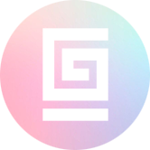

<div align="center" style="width:100%;">
  <a href="https://guillaumeesnault.fr/">
    
  </a>
</div>

<div style="display:flex">
  
  
  
  
</div>


# Welcome to my portfolio 

You will learn more about myself, what I do and have done.  
I try to create a good and sexy user experience, hope you will like it.


## How to install ?

``` zsh
yarn install

# Development
yarn dev

# Or production
yarn build
yarn start
```

## Library used in this project

- Next.js [https://nextjs.org/docs/getting-started](https://nextjs.org/docs/getting-started)
- Chakra-ui [https://github.com/chakra-ui/chakra-ui](https://github.com/chakra-ui/chakra-ui)
- i18next [https://github.com/i18next/i18next](https://github.com/i18next/i18next)
- React [https://github.com/facebook/react](https://github.com/facebook/react)
- Typescript [https://github.com/microsoft/TypeScript](https://github.com/microsoft/TypeScript)
- Framer Motion [https://github.com/framer/motion](https://github.com/framer/motion)
- Swiper [https://github.com/nolimits4web/swiper](https://github.com/nolimits4web/swiper)
